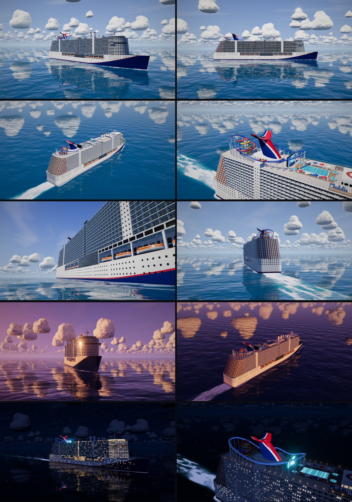

# Cruise ship — real-time 3D



`index.html` is the finished piece: one self-contained file (three.js and all code inlined, no
external assets or network requests). Open it directly in a desktop browser with WebGL2.

Everything is generated at load time (about 430k triangles): lofted hull, stepped fore/aft
terraces, ~2,000 balcony dividers, ~1,100 furnished balconies, ~500 sun loungers, 16 lifeboats with
davits, whale-tail funnel, roller coaster with moving cars, water slides, pools, radomes and
rotating radar. The sky has sphere-traced cumulus clouds (noise-displaced
signed-distance shapes, clustered by a GPU-baked field); the ocean has planar reflections, sun glint, bow wave and wake foam.
Three lighting moods (day, golden hour, night) re-bake the image-based lighting on the fly.

There is deliberately no text anywhere in the scene or UI.

## Controls

| Input | Action |
| --- | --- |
| Drag / pinch / scroll | Orbit, zoom, pan |
| View buttons or keys `1`–`7`, `←` `→` | Camera presets (bow three-quarter, broadside, aerial stern, top deck, waterline, bow-on, stern) |
| Sun / sunset / moon buttons, or `N` | Lighting mood |
| Play button or `Space` | Guided camera tour |
| Corner button or `F` | Fullscreen |
| `H` | Hide the control bar |

The bar fades out after a few seconds without pointer movement.

## Rebuilding

```sh
cd cruise-ship
npm install
npm run build   # bundles src/ with esbuild and inlines it into index.html
```

Debug query parameters: `?view=1..7`, `?mood=1..3`, `?q=1` (lock render scale).
